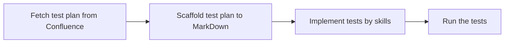

# nsclient_test_base

Base framework for testing new NSClient (Netskope Client) features across Windows, macOS, and Linux.

Each NPLAN gets its own folder under `features/`. Test plans are fetched from Confluence,
converted to Markdown, then scaffolded into pytest suites.



---

## Prerequisites

- Python 3.10+, no virtual environment — install globally
- `pip install -r requirements.txt`

---

## ⚠️ First-Time Setup — Secrets (Required)

API tokens and passwords are **never stored in plaintext**. They are encrypted at rest using a
local key that lives **outside the repository**. You must complete this setup before running any
tool that contacts Confluence or installs NSClient.

### Step 1 — Generate the encryption key

```
python tool/manage_secrets.py init
```

This creates:
```
C:\Users\<you>\.nsclient_test_base\.secret_key
```

The key file lives outside the repo and is never committed. It is the only thing that can decrypt
your stored secrets. **Do not delete it.** If you lose it, all stored secrets must be re-entered.

### Step 2 — Store your secrets

Run each command below and paste the value when prompted. Input is not echoed to the terminal.

```
python tool/manage_secrets.py set confluence_api_token
python tool/manage_secrets.py set install_token
```

Store only the secrets you actually need. Full list of known names:

| Secret name | What it is |
|---|---|
| `confluence_api_token` | Atlassian API token — required for `fetch_test_plan.py` |
| `install_token` | NSClient install token (`msiexec token=...`) |
| `org_key` | Linux `.run` installer org key (`-o` flag) |
| `enroll_auth_token` | IDP install mode `enrollauthtoken=` |
| `enroll_encryption_token` | IDP install mode `enrollencryptiontoken=` |
| `uninstall_password` | NSClient uninstall password (if protection is enabled) |
| `tenant_password` | Tenant admin console login password (for WebAPI test setup) |

### Step 3 — Verify

```
python tool/manage_secrets.py list
```

Expected output (example):
```
Stored secrets (2):
  confluence_api_token   — Confluence API token (for fetch_test_plan.py)
  install_token          — NSClient install token (msiexec token=...)
```

### Where things live

```
C:\Users\<you>\.nsclient_test_base\
    .secret_key          ← encryption key — outside repo, never in git

C:\git\nsclient_test_base\
    data\config.json     ← non-sensitive settings — git-tracked
    data\secrets.json    ← encrypted ciphertext — gitignored, never commit
```

`data/secrets.json` is in `.gitignore`. Even if it were accidentally committed, it is useless
without the key file.

---

## Non-sensitive configuration

Edit `data/config.json` directly. Sensitive fields (api_token, password) are ignored here — use
`manage_secrets.py set` for those.

```json
{
    "tenant_hostname": "your-tenant.goskope.com",
    "is_64bit": true,
    "log_dir": "log",
    "confluence": {
        "base_url": "https://netskope.atlassian.net/wiki",
        "username": "you@netskope.com",
        "api_token": ""
    }
}
```

---

## Workflow — NPLAN to Tests

### Step 1 — Fetch the test plan from Confluence

Copy the Confluence page URL and run:

```
python tool/fetch_test_plan.py <confluence_url> --nplan NPLAN-XXXX
```

Real example (NPLAN-6711):
```
python tool/fetch_test_plan.py https://netskope.atlassian.net/wiki/spaces/CDTBA/pages/7875198997 --nplan NPLAN-6711
```

Produces:
```
test_plans/nplan-6711.md      ← structured Markdown with all test cases
test_plans/nplan-6711.html    ← raw Confluence HTML (only with --save-html, for debugging)
```

The output filename is always `test_plans/<nplan-id>.md` (e.g. `nplan-6711.md`).  
The Confluence API token is injected automatically from the secrets store — no manual steps needed.

To also save the raw HTML for parser debugging:
```
python tool/fetch_test_plan.py <url> --nplan NPLAN-6711 --save-html
```

To write to a custom path:
```
python tool/fetch_test_plan.py <url> --nplan NPLAN-6711 --output test_plans/my_name.md
```

**What gets extracted:**
- Only rows that have an explicit ID in the Confluence table are kept — no invented IDs
- Test case title = first paragraph of the description cell
- Steps = bullet list items from the description cell
- Priority, Platform normalised automatically (`P0/P1/P2`, `Windows`, `macOS`, `Linux`, `All`)
- Section text (Feature Description, Scope, etc.) included above the test cases

---

### Step 2 — Scaffold pytest from the Markdown

```
python tool/gen_test_suite.py test_plans/nplan-6711.md
```

Produces:
```
features/nplan_6711_<slug>/
    conftest.py          ← feature-specific fixture stubs
    test_<slug>.py       ← one test_ function per test case
```

Preview without writing files:
```
python tool/gen_test_suite.py test_plans/nplan-6711.md --dry-run
```

Write to a custom folder:
```
python tool/gen_test_suite.py test_plans/nplan-6711.md --output features/nplan_6711_auto_reenable
```

Each test function gets:
- Correct markers (`@pytest.mark.priority_high`, `@pytest.mark.windows`, `@pytest.mark.automated`, etc.)
- Docstring with the full steps and expected result from the test plan
- `raise NotImplementedError  # TODO: implement` for automatable tests
- `pytest.skip("Manual test")` for manual tests

---

### Step 3 — Implement the tests

**Option A — `/gen-test` skill (recommended, requires Claude Code)**

The `/gen-test` skill generates **fully implemented** test functions — not just scaffolds.
It reads the test plan, analyses shared patterns, creates fixtures and reusable helpers,
and writes real test logic using the `util_*` toolkit.

```
/gen-test test_plans/nplan-6711.md A01 A02 A03
/gen-test test_plans/nplan-6711.md all
/gen-test test_plans/nplan-6711.md            # lists TCs and asks which to generate
```

The skill lives at `.claude/skills/gen-test/SKILL.md` and ships with the repo — anyone who
clones it gets `/gen-test` automatically (requires a one-time Claude Code restart if the
`.claude/skills/` directory was just created).

**Option B — Manual implementation**

Open the generated `test_<slug>.py` and replace each `raise NotImplementedError` with real
test logic using the toolkit APIs (`util_service`, `util_nsclient`, `util_process`, etc.).

---

### Step 4 — Run the tests

```
python -m pytest features/nplan_6711_<slug>/ -v
```

Filter by marker:
```
python -m pytest features/ -m p0                      # P0 only
python -m pytest features/ -m p1                      # P1 only
python -m pytest features/ -m "p0 and windows"        # P0 Windows only
python -m pytest features/ -m "windows and automated" # Windows automatable only
python -m pytest features/ -m "not manual"            # skip manual tests
```

---

### Full example — scaffold workflow

```
# 1. Fetch
python tool/fetch_test_plan.py ^
    https://netskope.atlassian.net/wiki/spaces/CDTBA/pages/7875198997 ^
    --nplan NPLAN-6711

# 2. Scaffold
python tool/gen_test_suite.py test_plans/nplan-6711.md

# 3. Check what was created
python -m pytest features/nplan_6711_wip_nplan_6711_auto_re_enable/ --co -q

# 4. Run P0 tests only
python -m pytest features/nplan_6711_wip_nplan_6711_auto_re_enable/ -m priority_high -v
```

---

## Implemented Feature Tests

### NPLAN-6711: Auto Re-enable NSClient after Disable

**Location:** `features/nplan_6711_auto_reenable/`

```
features/nplan_6711_auto_reenable/
    conftest.py              # session fixtures, ensure_client_enabled, assert_auto_reenable helper
    test_auto_reenable.py    # A01, A02, A03
```

**Test cases:**

| ID  | Function | Priority | Platform | What it tests |
|-----|----------|----------|----------|---------------|
| A01 | `test_a01_auto_reenable_3min` | P0 | All | Disable → auto re-enable after 3 min timer |
| A02 | `test_a02_auto_reenable_10min_otp` | P0 | Windows | Disable with OTP → auto re-enable after 10 min |
| A03 | `test_a03_ff_off_no_auto_reenable` | P1 | All | FF off → disable stays disabled (negative) |

**Prerequisites — one-time setup only:**

1. Set `tenant_hostname` and `tenant_username` in `data/config.json`
2. Store the tenant admin password:
   `python tool/manage_secrets.py set tenant_password`
3. A02 additionally needs the OTP/uninstall password:
   `python tool/manage_secrets.py set uninstall_password`
4. Ensure feature flag `nplan6711_auto_reenable_ns_client_after_disablement` is
   **enabled** on the tenant for A01/A02 and **disabled** for A03.

The tests configure `clientAllDisableAutoReenableDuration` on the tenant automatically
via WebAPI (`util_webui.py` → `pylark-webapi-lib`) and run `nsdiag -u` to sync the
config down to the client — no manual console steps required.

**Run commands:**

```
# Dry-run — verify tests collect without errors
python -m pytest features/nplan_6711_auto_reenable/ --co -q

# Run A01 only (waits ~4 min)
python -m pytest features/nplan_6711_auto_reenable/ -k a01 -v -s

# Run A02 only (waits ~11 min, needs stored OTP password)
python -m pytest features/nplan_6711_auto_reenable/ -k a02 -v -s

# Run A03 only (waits ~2 min, negative test)
python -m pytest features/nplan_6711_auto_reenable/ -k a03 -v -s

# Run all A-series
python -m pytest features/nplan_6711_auto_reenable/ -k "a01 or a02 or a03" -v -s

# Run P0 only (A01 + A02)
python -m pytest features/nplan_6711_auto_reenable/ -m p0 -v -s
```

> **Note:** Use `-s` to see real-time polling output. These are long-running integration tests
> that poll `nsdiag -f` every 10 seconds until the client re-enables or times out.

**Architecture:** All three tests share the `assert_auto_reenable()` helper (in conftest.py)
which handles the disable → poll → verify flow. It accepts an `interrupt` callback for
B-series tests (sleep/wake/reboot during the timer).

---

## Power Management

`util_power.py` provides sleep/wake and reboot control for tests that involve timer interrupts,
reboots, and sleep state transitions (e.g. NPLAN-6711 B-series tests).

### Platform support

| Function | Windows | macOS | Linux |
|---|---|---|---|
| `enter_s0_and_wake(sec)` | pwrtest `/cs` → monitor-off ctypes fallback | `pmset displaysleepnow` + `caffeinate` | returns `False` |
| `enter_s1_and_wake(sec)` | pwrtest `/sleep /s:1` → `SetSuspendState` fallback | `pmset sleepnow` + scheduled wake | returns `False` |
| `enter_s4_and_wake(sec)` | pwrtest `/sleep /s:s4` → `SetSuspendState(hibernate)` | mapped to system sleep | returns `False` |
| `is_sleep_state_available(name)` | `powercfg /a` (EN + ZH-TW) | `pmset -g cap` | `False` |
| `enable_wake_timers()` | 3× `powercfg` GUIDs | `True` (N/A) | `False` |
| `reboot()` | `shutdown /r /t 0` | `sudo shutdown -r now` | `sudo reboot` |

### Usage in tests

```python
from util_power import (
    enter_s0_and_wake,
    enter_s1_and_wake,
    enter_s4_and_wake,
    is_sleep_state_available,
    enable_wake_timers,
    reboot,
)

# Check availability before entering a sleep state
if is_sleep_state_available("Hibernate"):
    enter_s4_and_wake(duration_seconds=300)

# Enable wake timers before any sleep test on Windows
enable_wake_timers()
enter_s1_and_wake(duration_seconds=120)
```

### Sleep state names for `is_sleep_state_available`

| Name | State |
|---|---|
| `"Standby (S0 Low Power Idle)"` | Modern Standby / AOAC |
| `"Standby (S1)"` | Legacy Standby |
| `"Hibernate"` | S4 Hibernate |

### Windows requirements

- **Admin privileges required** — `powercfg` and sleep state transitions need elevation.
  Use the `require_admin` fixture in feature tests.
- **pwrtest.exe** — bundled at `tool/pwrtest.exe`. Used for reliable sleep cycling.
  Falls back to ctypes if missing, but pwrtest is preferred.
- **Wake timers** — call `enable_wake_timers()` once before sleep tests, or add it to
  your feature `conftest.py` as a session-scoped fixture.

### Platform safety

Power functions on Linux return `False` cleanly — they never import Windows-only modules.
Tag sleep-state tests with the appropriate platform marker so they are auto-skipped on
other platforms:

```python
@pytest.mark.windows
@pytest.mark.priority_medium
def test_b04_s0_modern_standby(require_admin):
    enable_wake_timers()
    assert enter_s0_and_wake(duration_seconds=60)
```

---

## Running unit tests

Unit tests live in `test/` and run fully mocked — no admin, no services, no NSClient required.

```
python -m pytest -v
```

---

## Managing secrets

```
python tool/manage_secrets.py init              # First-time: generate key
python tool/manage_secrets.py set <name>        # Store/update a secret (prompts, no echo)
python tool/manage_secrets.py get <name>        # Print decrypted value
python tool/manage_secrets.py list              # List stored names
python tool/manage_secrets.py delete <name>     # Remove a secret
python tool/manage_secrets.py info              # Show key path, store path, all known names
```

### Rotating a secret

```
python tool/manage_secrets.py set confluence_api_token   # re-enter new value, overwrites old
```

### Moving to a new machine

The secrets store (`data/secrets.json`) is gitignored and not in the repo. On a new machine:

1. `python tool/manage_secrets.py init` — generates a **new** key
2. Re-enter all secrets: `python tool/manage_secrets.py set <name>` for each one

There is no export/import — each machine has its own key and its own local secrets file.

---

## Project structure

```
.claude/
    agents/nsc_test_angel.md      # AI agent for NPLAN test development
    skills/gen-test.md            # /gen-test skill — generate implemented tests from test plan
data/
    config.json                   # Non-sensitive settings (git-tracked)
    secrets.json                  # Encrypted secrets (gitignored)
features/
    nplan_6711_auto_reenable/     # NPLAN-6711: Auto re-enable (A01–A03 implemented)
    nplan_XXXX_<name>/            # One folder per NPLAN
        conftest.py
        test_<feature>.py
test/
    conftest.py                   # Mocked fixtures for unit tests
    ut_backlog.md                 # Pending test coverage
test_plans/                       # Confluence-sourced Markdown
tool/
    fetch_test_plan.py            # Confluence → Markdown
    gen_test_suite.py             # Markdown → pytest scaffold
    manage_secrets.py             # Encrypted secret management
    pwrtest.exe                   # Windows sleep/wake tool (bundled from stress_test)
util_client_status.py             # Client status detection via nsdiag -f (all platforms)
util_webui.py                     # Tenant WebAPI client (pylark-webapi-lib wrapper)
util_config.py                    # Project config loader
util_crash.py                     # Crash dump detection
util_install.py                   # Install / uninstall (all platforms)
util_log.py                       # Logging setup
util_log_validator.py             # NSClient debug log reader and validator
util_nsclient.py                  # NSClient inspection
util_power.py                     # Sleep/wake/reboot (Windows full, macOS partial, Linux stub)
util_process.py                   # Process management
util_registry.py                  # Windows registry helpers
util_secrets.py                   # Encrypted secret store
util_service.py                   # Service control (all platforms)
CLAUDE.md                         # Coding standards + NSClient knowledge
knowledge_gap.md                  # Unresolved platform questions
pytest.ini                        # Markers, test discovery
requirements.txt
```
